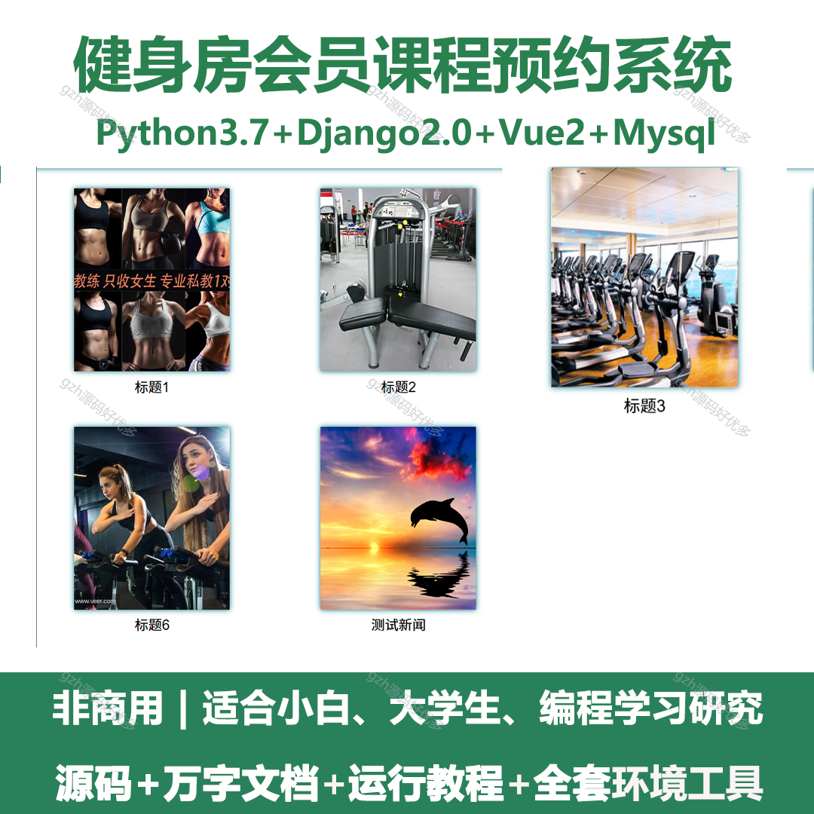
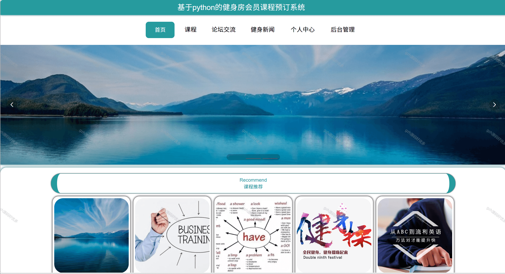
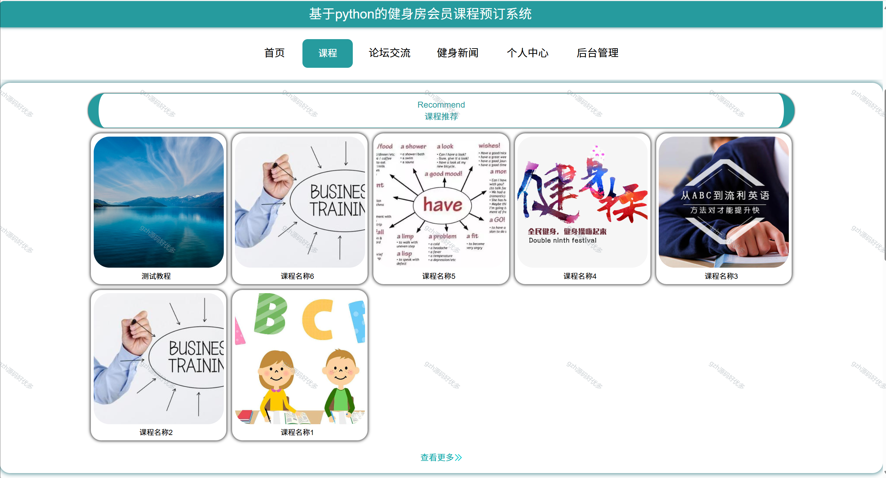
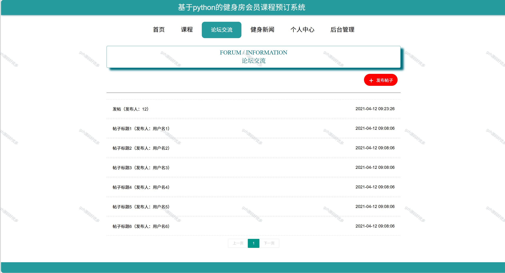
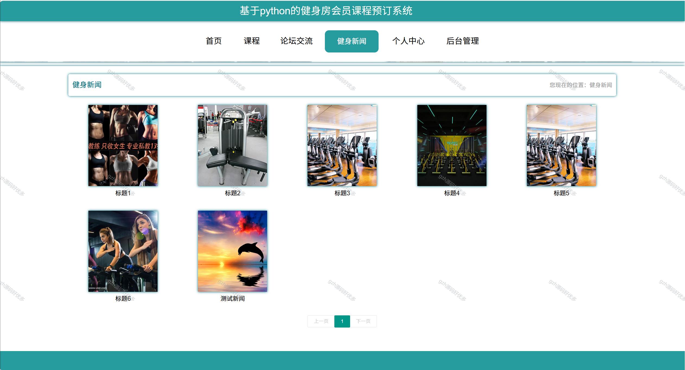
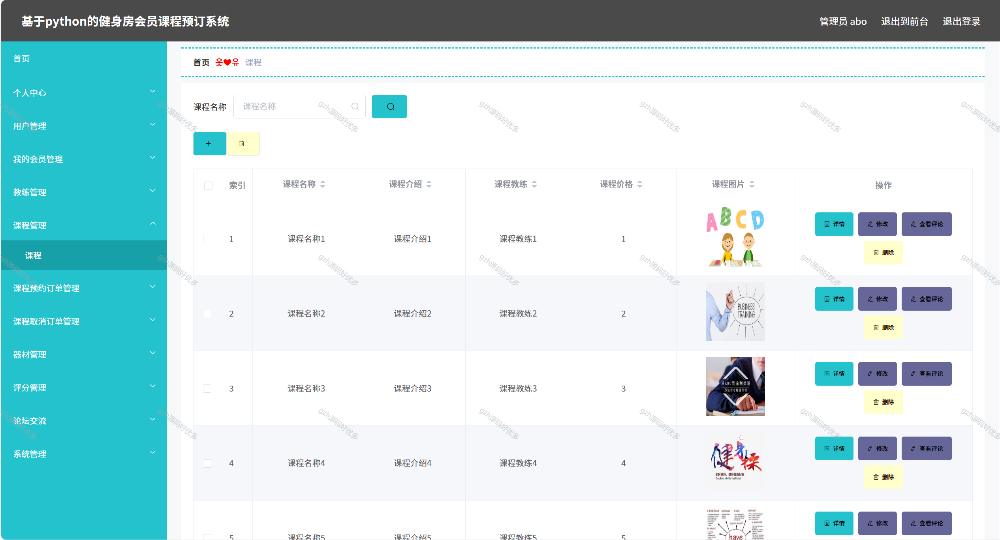
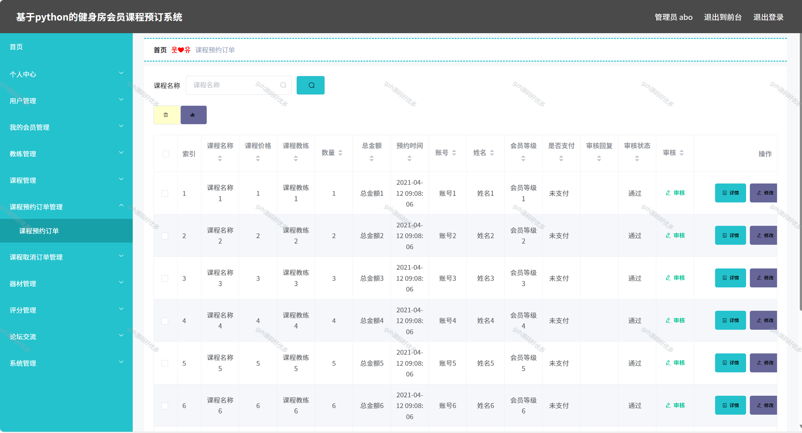
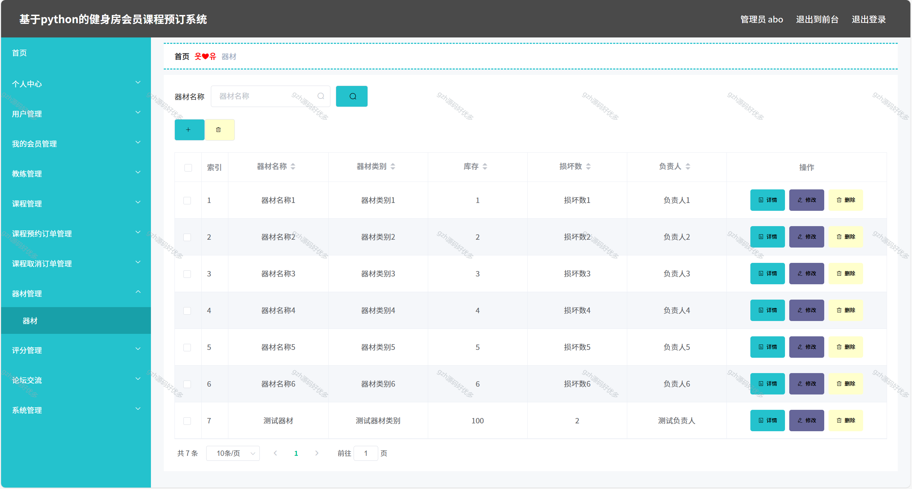
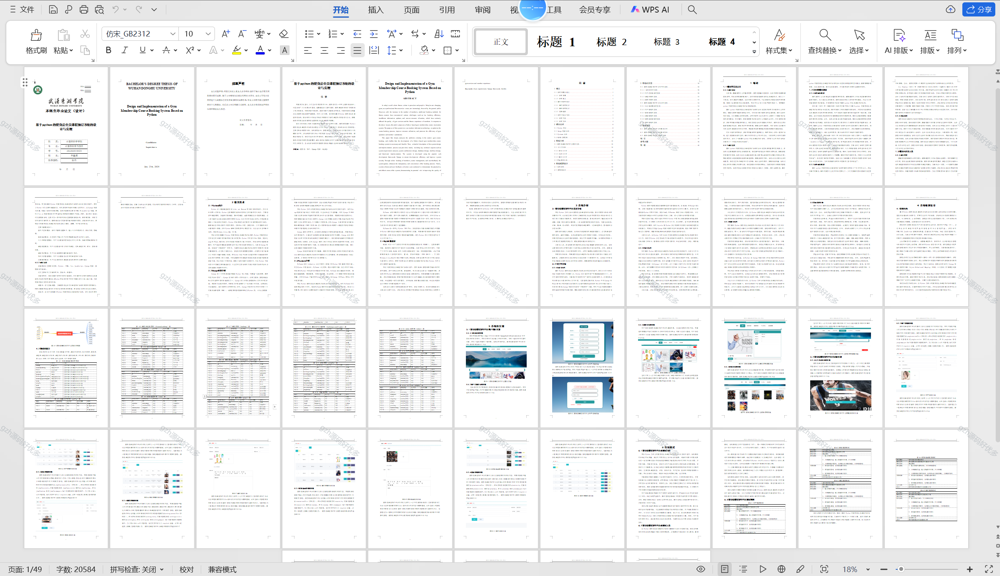

# python088
python088基于Python+Django的健身房会员课程预订系统+LW
 
## 查看主页获取源码

### 一、关键词
健身房会员课程预约系统，健身会员课订课系统，健身房课程会员预订平台

### 二、作品包含
源码+数据库+设计文档万字+全套环境和工具资源+本地部署教程

### 三、项目技术
前端技术：Vue2.0、Element-ui、Layui
后端技术：Python3.7、Django2.0

### 四、运行环境（以下版本亲测，其他版本兼容性请自行测试）
开发工具：PyCharm + VSCODE

数据库：MySQL5.7（最低要5.7版本）

数据库管理工具：Navicat10+

Python：Python3.7

前端Nodejs：14

浏览器：谷歌浏览器

### 五、项目介绍
项目编号：python088

系统的目的是运用现代信息技术手段对课程预订流程进行优化，提高资源利用率以促进健身房运营效率及会员满意度的提高。
通过对会员进行在线预订，课程管理以及用户反馈，该系统极大地增强预订过程的透明度与便捷性。最后通过系列测试及用户反馈收集证明该系统具有实用性及有效性，显示出该系统对改善健身房服务质量及会员体验具有潜在作用。

### 六、运行截图

